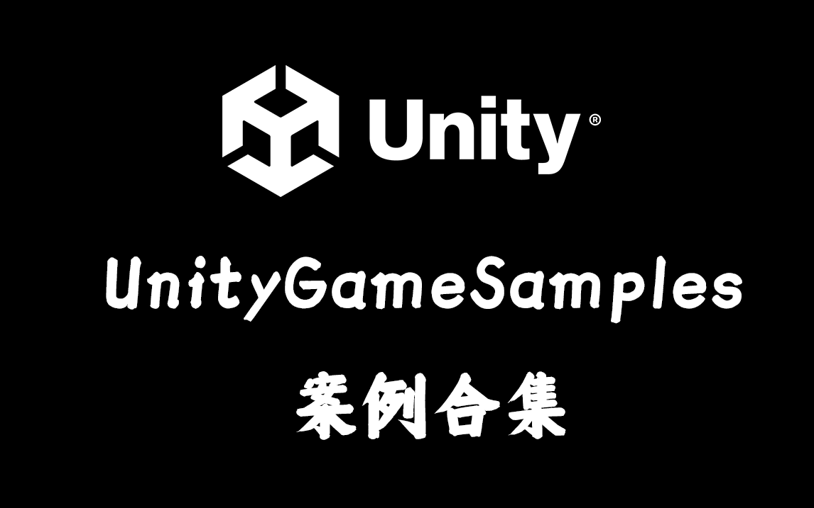
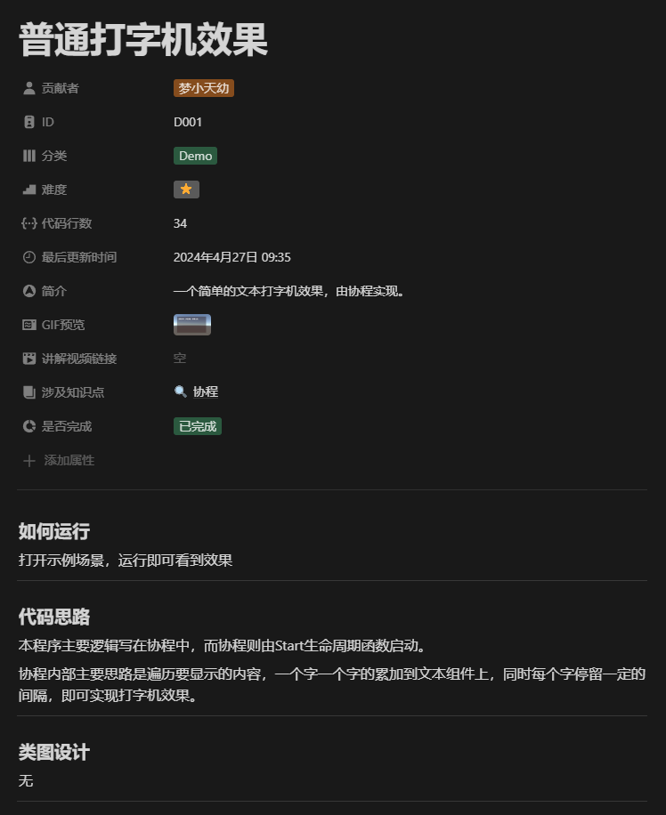
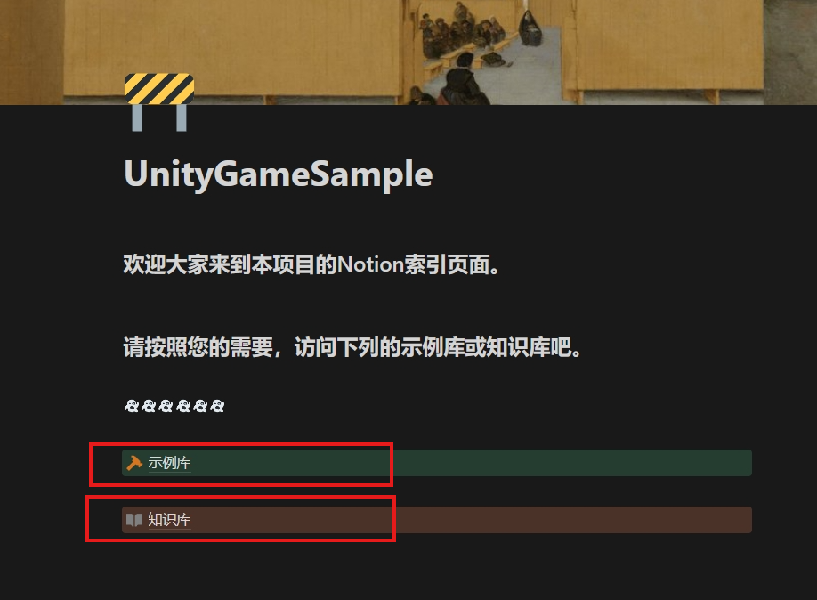
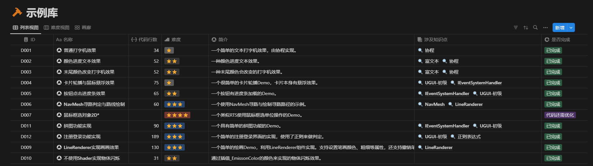
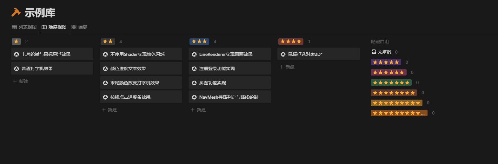
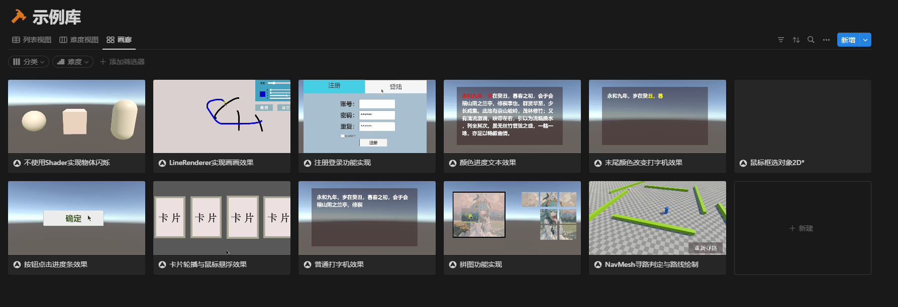
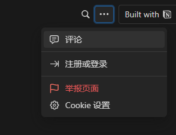
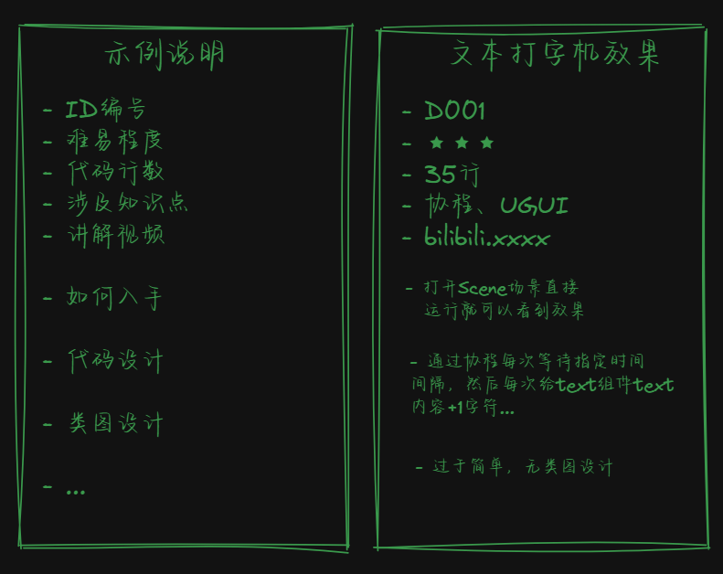

<div id="top"></div>

<!-- 项目 LOGO -->
<br />
<div align="center">
  <a href="https://github.com/Drenayo/UnityGameSamples">
    
  </a>

  <h3 align="center">UnityGameSamples</h3>

  <p align="center">
    Unity基建开源项目计划
    <br />
    <a href="https://github.com/Drenayo/UnityGameSamples/tree/main/Assets/Demo">查看 Code</a>
    ·
    <a href="https://github.com/Drenayo/UnityGameSamples/issues">反馈 Bug</a>
    ·
    <a href="https://drenayo.notion.site/Unity-Game-Sample-18cc3c76db3946609a18483341b620fe">查看 Demo</a>
    <br />
  </p>
</div>

<!-- 目录 -->
<details>
  <summary>目录</summary>
  <ol>
    <li>
      <a href="#使用流程">使用流程</a>
    </li>
    <li>
      <a href="#项目介绍">项目介绍</a>
      <ul>
        <li><a href="#1分类">1.分类</a></li>
        <li><a href="#2项目结构">2.项目结构</a></li>
        <li><a href="#3示例说明">3.示例说明</a></li>
        <li><a href="#4快速查找所需示例">4.快速查找所需示</a></li>
        <li><a href="#5Notion使用">5.Notion使用</a></li>
      </ul>
    </li>
    <li><a href="#近期规划">近期规划</a></li>
    <li><a href="#项目依赖">项目依赖</a></li>
    <li>
      <a href="#如何贡献">如何贡献</a>
      <ul>
        <li><a href="#贡献知识库">贡献知识库</a></li>
        <li><a href="#贡献案例代码">贡献案例代码</a></li>
      </ul>
    </li>
    <li><a href="#问答部分">问答部分</a></li>
    <li><a href="#联系我们">联系我们</a></li>
    <li><a href="#致谢">致谢</a></li>
  </ol>
</details>


## 使用流程

UnityGameSamples项目旨在提供一系列简单的Unity功能示例，帮助学习者参考和学习某些功能、模块的写法，并迅速熟悉一些知识点的内容，帮助游戏开发者快速找到自己想要的模块，组装自己的游戏，快速验证想法。

当学习者遇到特定功能无法实现时,可以查阅本项目的功能目录,找到对应的实现逻辑。每个功能示例都附带视频教程、UML 类图解析、演示案例以及源代码,循序渐进地帮助初学者掌握该功能。

当开发者想要快速寻找自己想要的模块时，查阅本项目的模块目录，找到对应模块，每个模块都附带自述文件，自述文件附带该模块的一切详尽的解释。

---

## 项目介绍

如果想要了解该项目，你需要从该项目的主要分类与项目结构入手。

### 1.分类

该项目目前收录4种形式的示例，分别是：

- D : 简单Demo示例
- M : 模块Demo示例
- S : Shader示例
- E : 编辑器工具示例

注意，为了更方便的查找与分类，我为每个分类都设置了一个字母代号，某个分类下收录的示例会分配一个ID编号，ID编号组成结构为：字母代号+3位数数字序号  ----   例如：[D001]

---

**收录示例**：(你可以通过下面的示例看出四种分类分别都用于收录什么内容)

- **简单Demo**：注册登录功能、拼图功能、NavMesh寻路路径绘制、按钮点击进度条功能等...
- **模块Demo**：对话系统、存储系统、武器系统、任务系统等..
- **Shader**：消融效果、水溶效果、红旗飘扬效果等...
- **编辑器工具**：读取Excel工具、自动生成Prefab工具、生成音频工具、Editor动画预览工具等..
---

### 2.项目结构

```
--Art                      所有示例可共享的项目资源,如字体、材质等
--Editor                   编辑器工具示例
    --E001
    --E002
    --ProjectTools         维持项目运转所需工具
--Plugins                  插件目录
--Demo                     简单Demo目录
    --D001-xxx             编号D001-Demo位置                 
    --D002
    --D003
--Modules                  模块示例目录
    --M001
--Shader                   Shader示例目录
    --S001
    --S002
```

---

### 3.示例说明

从上述分类与项目结构可以得知，整个项目的基本概要是由一个个示例组成，示例又分为了几个大类(后续可能会扩充新的分类)，那么每个示例的文件夹中包括示例场景、示例代码以及独立对应资源。

为了让初学者快速了解该示例Demo，我使用Notion构建了一个数据库，每个示例都有一个属于自己的页面，会说明**该示例的ID编号、涉及知识点、代码行数、难度等基本信息**，还会详尽的阐述**如何入手该示例**、**该示例的设计思想**等，同时会附带一个**讲解该示例的视频链接**。



---

### 4.快速查找所需示例

如果您想要快速浏览该项目都有哪些示例，除了在线浏览GitHub项目外，还可以通过Notion查找，Notion是一款集成了笔记、知识库、数据表格、看板、日历等多种能力于一体的应用程序。

这里我用到了Notion的数据库功能，方便存储与索引数据，还用到了Notion的看板等功能，方便展示。**遗憾的是Notion不使用科学手段访问较慢**，我在未来计划将这些数据复制一份到国内的FlowUs或wolai(类Notion应用)，但不是现在。

[Notion传送门](https://drenayo.notion.site/UnityGameSample-18cc3c76db3946609a18483341b620fe)| 推荐科学上网

### 5.Notion使用

当你点击链接后，会进入如图所示页面，我将数据分成了两大类，其一，示例库，其二知识库(构建中)。我们可以先点击示例库。


示例库如图所示，你可以根据ID，难度，设计知识点等来索引和查询。



**请看这张示意图！！它可以帮助你快速预览一个Demo是什么效果。当你知道真面目了再点击进去看详细内容，对内容也有了大概了解后，就可以去项目实际体验演示效果，以及看代码。**



<!-- 待完成规划 -->
## 近期规划

- [ ] 为UGS开发预览Wiki编辑器工具
- [ ] 添加网络相关的简易Demo
- [ ] 收录常见Shader
- [ ] 收录算法可视化Demo
- [ ] 编写收录常用编辑器工具案例

近期完成内容
- [X] README首页信息优化
- [X] 整理知识库、添加一部分知识库链接


到 [OpenIssues](https://github.com/Drenayo/UnityGameSamples/issues) 页查看所有请求的功能 （以及已知的问题）


## 项目依赖

本项目的附加组件和插件列表：

* Unity2021
* [ParrelSync-项目多开插件](https://github.com/VeriorPies/ParrelSync)
* [Odin](https://odininspector.com/)
* TextMeshPro
* Newtonsoft.Json
* WavUtility.cs

## 如何贡献

米娜桑，欢迎参与项目共建，目前该项目提供一下几种贡献方式。

### 贡献知识库

如果你想要了解某个功能的实现,但该功能并未包含在本项目中,可以提交 Issue 请求(需求写详细一点)。

如果你对某个示例有建议或意见，建议直接在某个Demo的专属Notion页面进行评论。方便我查收，也方便别人查看。

每个页面的右上角，点击三点符号，需要注册账号才能评论。


关于涉及知识点的说明：一个个Demo形成的是知识点网络是本项目的一大亮点，每个Demo都会涉及一些知识点，每个知识点都有一个单独页面，上面罗列了学习该知识点的资料链接，其中有视频、文章、问答贴等等，每个连接还有评语。

为了保证方便查询和索引，所以示例库和知识点库的管理由Notion进行管理。如果你想要短期贡献一段代码，请直接提交PR即可，如果你想要贡献新的知识点或者连接，提交issues即可，我会同步到Notion上，如果你想要长期贡献，直接通过github主页的邮箱与我联系。 

### 贡献案例代码
如果你想要贡献某个案例，可以通过PR的形式来提交。


一个完整的案例包括一下部分：（如下图所示）
* 可运行的代码，用于展示的示例场景
* Notion说明页面
* 运行GIF
* 代码简单介绍
* 视频教程



如果你不擅长录制视频，视频部分可以由我来完成，所以你需要在指定文件夹添加一个Demo，为该Demo起一个ID编号，以及确定该Demo的详细信息，将其写在一个md文件上，放在代码文件夹中。

我会帮忙同步到Notion展示页上。


## 问答部分

Q:这个项目会更新多久？
A:该项目作为公开开源项目，会不断收录新的Demo示例，同时也会接受其他开发者pr的示例。

Q:我是初学者，我可以参与这个项目吗？
A:完全可以，如果你是初学者，对项目有任何疑问可以提交Issues，如果你是手里刚好有一些案例，是该项目没有的，就可以提交PR，如果你不会，也可以直接发我邮箱，我来提交。

Q:1+1 = ？
A:2(昂首挺胸！)


<!-- 联系我们 -->
## 联系我们

邮箱：drenayo@qq.com
B站：[梦小天幼](https://space.bilibili.com/104418839?spm_id_from=333.1007.0.0)

Drenayo 最新更新于 2024.07.20

